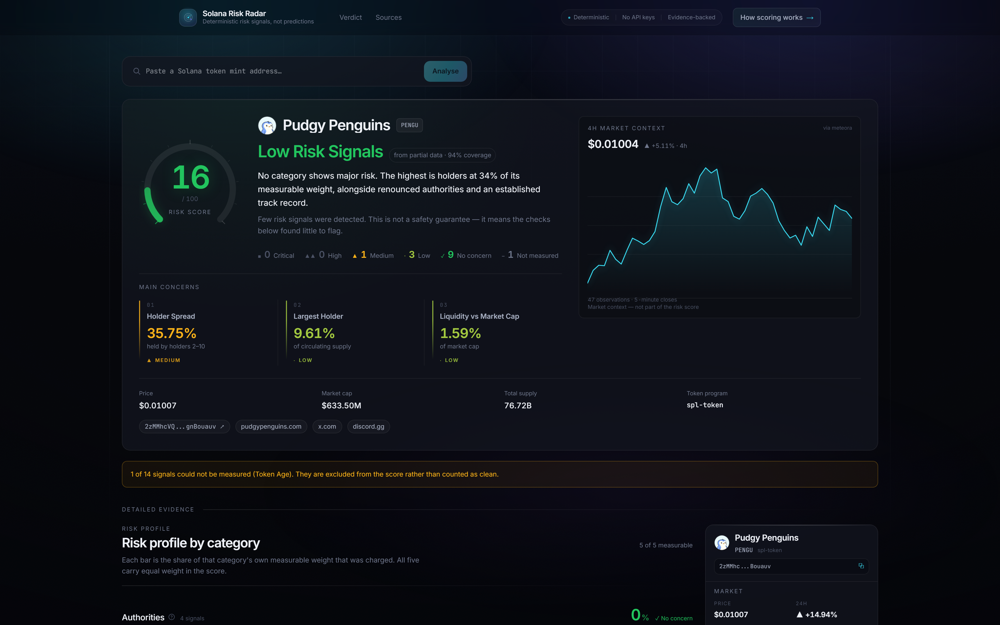
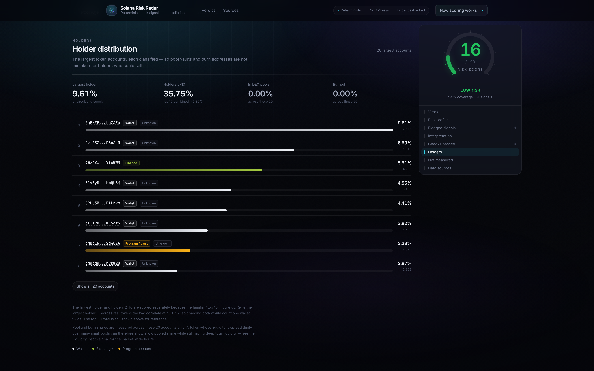
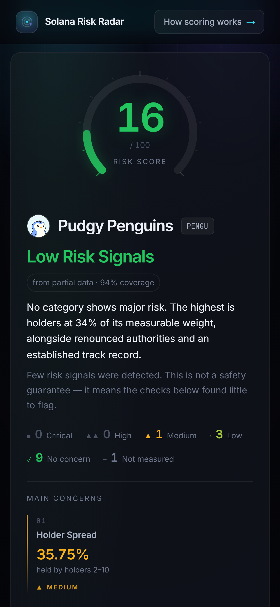

<h1 align="center">Solana Risk Radar</h1>

<p align="center">
  <b>Know a token's risk before you touch it.</b>
</p>

<p align="center">
  Paste a Solana mint address. Get an evidence-backed, deterministic risk report<br>
  built from live on-chain and market data — with the raw evidence behind every signal.
</p>

<p align="center">
  <a href="https://solana-risk-radar.vercel.app"></a>
  <a href="https://youtu.be/mt8Vz-wzu1E"></a>
  <a href="https://x.com/RadfarSam"></a>
  <a href="https://t.me/Radfarsam"></a>
</p>

<p align="center">
  
  
  
  
  
</p>

<p align="center">
  
</p>

<p align="center">
  <em>A finished report: the score, the one-sentence reason it landed there, the three signals<br>
  that contributed most, and the 4H market context — which is deliberately not scored.</em>
</p>

> **Not financial advice.** This tool reports verifiable risk factors. It never claims a token
> is "safe" or a "scam", and it does not detect fraud.

Built for the Superteam Germany **Road to Colosseum Hackathon**.

---

## What it does

Solana Risk Radar takes any SPL or Token-2022 mint address and produces an **explainable risk
report** in seconds. It reads real on-chain and market data at request time, runs it through
thirteen deterministic rules with published thresholds, plus one conservatively weighted
external security cross-check from RugCheck, and shows exactly which signals drove the result.

- **No LLM decides anything.** Every number comes from a published rule with a published
  threshold, and identical inputs always produce an identical score.
- **Every claim opens onto its evidence.** Each signal shows what was measured, what was found,
  how many points it contributed and why, with links back to the chain.
- **Missing data stays missing.** A signal that cannot be measured scores zero *and* drops out
  of the denominator, so nothing is ever made to look safe by data that failed to load.

## Why it matters

Most token checkers answer with a number and no working. Worse, several of them are wrong in
ways that matter: they count token *accounts* as holders, trust whichever pool quotes the
loudest price, and silently treat unmeasured data as clean.

Risk Radar is built the other way round. The point is not the score — it is that the score is
**auditable**, and that where it cannot know something, it says so.

---

## How it works

```
Solana mint address
   ↓  validated in the browser and again on the server (same pure function)
Live data providers      Solana JSON-RPC · Metaplex / Token-2022 · DexScreener · GeckoTerminal · RugCheck
   ↓  fetched concurrently
Validation               canonical mint identity, multi-pool consensus, outlier rejection
   ↓
Evidence resolution      token accounts → owning wallets → controlling program
   ↓
Risk analysis            13 deterministic rules + RugCheck cross-check, 5 equally weighted categories
   ↓
Explainable report       score · verdict · main concerns · full evidence · provenance
```

The report is presented in two layers. **Quick assessment** answers the question on its own —
score, band, a one-sentence reason it landed there, how many findings at each severity, and the
three that contributed most. **Detailed evidence** holds everything behind that answer: the
category breakdown, every signal with its raw evidence, the classified holder table, liquidity
safety, and the data provenance. Nothing is summarised away.

Full detail: [`ARCHITECTURE.md`](ARCHITECTURE.md) · [`METHODOLOGY.md`](METHODOLOGY.md) ·
[`DEMO.md`](DEMO.md)

---

## Key capabilities

| Capability | What you get |
|---|---|
| **Authority analysis** | Mint authority, freeze authority, Token-2022 transfer controls, metadata mutability |
| **Holder concentration** | Largest holder and holder spread (2nd–10th), scored as independent signals |
| **Holder identity & control** | Each account resolved to its owning wallet, then classified by the program that controls it |
| **Liquidity analysis** | Total depth, depth vs market cap, pool diversity |
| **Liquidity Safety** | Per-pool LP custody — burned, frozen, lock program, staked, wallet or unknown |
| **Market activity** | Volume vs liquidity, buy/sell balance, 24h price movement |
| **Maturity** | Pool age, reported as unmeasured when no corroborated pool timestamp is available |
| **Evidence provenance** | Every signal carries well-formed, absolute-https evidence matching the exact claim it makes |
| **Multi-provider resolution** | Separate provider opinions, independent agreement, explicit conflict/unverified states |
| **Coverage & confidence** | Both reported on the face of the report, never implied |
| **Unknown / Not Measured** | A first-class outcome, rendered as such — never as a zero |

**All five risk categories carry equal weight**, and they are combined non-compensatorily:
clean dimensions cannot cancel out severe ones.

---

## Methodology & explainability

The full derivation, every threshold and the calibration data are in
[`METHODOLOGY.md`](METHODOLOGY.md). The principles that shape it:

**Canonical token identity.** The mint account is read first and everything else is verified
against it. Market and history observations prove whether the requested mint is base or quote.

**Holders are classified, not just counted.** `getTokenLargestAccounts` returns token
*accounts*, not people. A pool vault holding 40% of supply is liquidity, and a burn address
holding 40% is supply that no longer exists — neither is a whale who can dump on you. Risk
Radar resolves each account to its owning wallet, then classifies that wallet by the program
that owns it, so concentration is measured over genuinely sellable supply.

**Holder control is verified, never guessed.** Balances are first aggregated **by owner**,
because one wallet spread across several token accounts would otherwise read as several smaller
holders. Each owner is then checked against the program that owns it, its decoded SPL multisig
configuration, and the token account's own frozen flag. Nothing is inferred from balance size,
inactivity, or the token's name, and an address that cannot be explained is labelled **Unknown**
and stays that way.

The distinctions that carry the risk are kept apart:

- **Multisig is not a lock.** A 4-of-7 needs more signatures, not more time — it can still sell
  today. The real threshold is shown when it can be decoded, and guessed at never.
- **Custody by a vesting program is not a verified lock.** Streamflow, Jupiter Lock, Bonfida and
  similar programs are recognised by program ID, but their release schedules cannot be read
  generically. Those holdings are disclosed as *Lock / vesting program* and contribute **zero**
  locked supply — part of the allocation may already be claimable, and calling it "Locked" while
  counting none of it would be exactly the false reassurance this tool exists to avoid.
- **Only an enforced, readable restriction reduces risk** — today, a frozen token account. Even
  then the copy notes that the mint's freeze authority can lift it.

This produces **effective liquid concentration**: the largest position that could actually be
sold right now. It is taken as the maximum liquid share *across* holders rather than the largest
holder's own remainder, so a heavily frozen number-one holder can never mask a fully liquid
number two. The raw concentration figure remains the headline — a locked 25% is still 25% of
supply — and both appear in the evidence.

**Token-2022 extensions are read.** A permanent delegate can move tokens out of your wallet at
any time, and a transfer hook can block a sale outright. These are invisible to checkers that
only look at mint and freeze authority.

**Correlated signals are not double-counted.** "Largest holder" and "top 10 holders" correlate
at r = 0.92 on real tokens, because the top 10 *contains* the largest — scoring both charges one
wallet twice. Risk Radar scores the marginal share instead (holders 2–10, r = 0.07 against the
largest), so the two signals answer genuinely different questions: *can one actor crash this?*
and *is there a bloc behind them?* The familiar top-10 figure is still shown.

<details>
<summary><b>Market data integrity — conservative conflict handling</b></summary>

<br>

Pool observations are not independent providers. DexScreener and GeckoTerminal each
produce an identity-checked, orientation-safe opinion; only independent agreement
can establish a canonical price. Shared quote dependencies are grouped and USD
liquidity never votes for its own valuation. Unresolved clusters remain conflicts.

Price, circulating supply, 24h change and corroborated pool metrics each have a
validation state. Single-source, conflicting and unavailable values are withheld
from canonical display and price-dependent risk rules. FDV requires validated
price and on-chain supply. Market cap additionally requires corroborated supply
provenance. No unavailable measurement is counted as clean.

See [Market integrity architecture](docs/MARKET_INTEGRITY.md) for thresholds,
provenance, empirical tolerance observations, request limits and limitations.
Public providers can still agree incorrectly; agreement is not a guarantee.

</details>

<details>
<summary><b>4H Market Context — why it is not scored</b></summary>

<br>

GeckoTerminal history is requested in USD for the exact mint, including quote-side
mints, and checked on the server before scoring. A fresh close that contradicts
spot invalidates the market valuation and appears in diagnostics. The four-hour
return itself is not scored. Fewer than six usable points prevents chart rendering;
unavailable history is never presented as confirmation.

</details>

---

## Liquidity Safety

The holder panel answers *can one wallet dump this?* Liquidity Safety answers the other half of
the same question: **can one wallet remove the market itself?**

For every accepted pool, the LP token supply is traced to its holders and each holding is
classified by how it is custodied:

| Custody | What it means |
|---|---|
| **Burned** | LP held where it can never be redeemed — the pool reserves behind it are permanently stranded |
| **Frozen** | The LP token account cannot be transferred. The freeze authority can lift this, so it is not permanent |
| **Lock program** | Custodied by a known LP lock program. The release schedule could not be read, so it is disclosed but **not counted as locked** |
| **Farm / staked** | Deposited in a farm or staking program. The depositor can withdraw at any time — this is not a lock |
| **Program account** | Owned by an on-chain program rather than a wallet. No lock is implied |
| **Wallet** | An ordinary wallet. This LP can be redeemed for the pool's reserves at any time |
| **Unknown** | Could not be explained, and is left that way |

**It is informational and contributes nothing to the score.** Every percentage is a share of the
liquidity that could actually be measured, and a coverage figure sits beside them saying how
much of the market that was. Where nothing could be measured the panel reads **Not measured**
and draws no bar at all — because a missing measurement rendered as "0% unlocked" would be the
strongest possible safety claim, made from no evidence.

---

## Evidence, coverage & confidence

Risk Radar is built to be trustworthy about what it does *not* know:

- **Missing data is excluded, never guessed.** Coverage is shown on every report, and below 40%
  the score is withheld entirely as **Insufficient Data**.
- **A single severe finding does not max the score.** One fully compromised category scores 45
  of 100 — deliberately. Two reach "High". The specific danger is surfaced in "Main concerns"
  rather than inflated into the headline number.
- **Pool age requires a measured timestamp.** When no independently corroborated pool
  creation timestamp is available, maturity is unmeasured and excluded from scoring.
- **Pool and burn shares cover the largest accounts only**, not the whole supply. The UI says so
  where it matters.
- **Market data reflects what DexScreener and GeckoTerminal have indexed.** A token with no
  indexed pool has no market data to validate, which is a real finding, not a bug. Consensus is
  resistant to a manipulated pool, but not to providers that agree incorrectly.
- **Vesting schedules are never read.** Real, honest locks therefore appear as *Lock / vesting
  program* with zero locked supply. This errs toward reporting more risk than exists, which is
  the safe direction.
- **Holder analysis covers the largest 20 accounts.** Enough to detect concentration; not a full
  holder census.
- **Public RPC endpoints rate-limit.** When every endpoint fails, holder analysis is reported as
  unavailable and drops out of the score rather than being silently approximated. Setting
  `SOLANA_RPC_URL` removes this almost entirely.
- **A clean report is not a guarantee.** Off-chain promises, team intent, and logic in other
  programs are not visible here at all.

---

## Architecture

A single Next.js app. No database, no accounts, no API keys — everything is read live at request
time and nothing is stored.

| Source | Used for | Auth |
|---|---|---|
| **Solana JSON-RPC** | Mint account, token accounts and their owners, account states, SPL multisig decoding | None — a built-in list of public endpoints with automatic failover, or your own via `SOLANA_RPC_URL` |
| **Metaplex / Token-2022 metadata** | Name, symbol, update authority, mutability, extensions | None — read directly from chain |
| **DexScreener** | Pools, liquidity, volume, trade counts, pool age, quoted prices | None — free public API |
| **GeckoTerminal** | Independent second market opinion for price consensus; hourly OHLCV as the 24h-change fallback; 5-minute OHLCV for the 4H market context chart | None — free public API |
| **RugCheck** | External security cross-check (Rug / Security Risk). Weight 6 only when it reports RugCheck-specific issues; clean, overlap-only or unavailable results are context only and never lower the 13-signal score | None — public report summary API |

The two market APIs are rate-limited on their free tiers, so completed reports are cached in
process for 60 seconds and chart history for the same. That cache is the only long-lived state,
and it is purely an optimisation — nothing breaks when it is cold, which is why no database is
needed.

Rule logic is pure: each rule is a function from a typed `AnalysisInput` to a `RiskSignal`, with
no clock, randomness or I/O. Module-by-module breakdown in [`ARCHITECTURE.md`](ARCHITECTURE.md).

<details>
<summary><b>Testing</b></summary>

<br>

```bash
npm test        # 354 unit tests, no network
```

These cover every threshold boundary, both directions of each two-sided rule, the missing-data
paths, and the aggregation invariants (no signal can charge more than its weight; an unavailable
signal charges nothing; identical inputs give identical scores). Five groups are worth calling
out:

- **Calibration** — pins the aggregation itself: that clean dimensions cannot cancel severe
  ones, that the score rises monotonically with risk, that one compromised category can never
  alone produce a "High" verdict, and that realistic token archetypes land in their bands.
- **Correlation** — proves the two holder signals stay independent: two tokens with
  near-identical top-10 totals but opposite shapes produce opposite findings.
- **Evidence** — audits the trust feature: every measured signal carries well-formed evidence,
  links are absolute https, evidence matches the exact claim its signal makes, and an unmeasured
  signal never implies a measurement happened.
- **Market consensus** — proves the price engine's breakdown resistance: a single pool quoting
  5,000× cannot move the consensus, outliers are rejected with a recorded reason, and market cap
  is withheld when it contradicts on-chain supply.
- **Holder control** — mostly asserts the system's *refusal* to classify: a big balance is not a
  treasury, an idle wallet is not locked, a multisig is not a lock, and a lock program never
  reports enforced locked supply.

Beyond unit tests, the app was driven end to end against real mainnet tokens:

| Token | What it exercises |
|---|---|
| USDC | Mainstream asset with live mint *and* freeze authority by design |
| Wrapped SOL | Reports `supply: 0` on chain — the division-by-zero trap |
| BONK | Renounced authorities, deep liquidity, healthy trading |
| JUP, PENGU, JitoSOL | Varied concentration and liquidity profiles |
| PYUSD | Token-2022 path: permanent delegate, transfer hook, transfer fee |
| TRUMP | Genuinely extreme holder concentration |
| invalid / non-mint / token-account / nonexistent addresses | Error handling |

`npm run probe` re-runs that sweep and asserts the report invariants, including that every
listed concern traces back to a measured signal and that the severity counts total the signal
count. `npm run ui-check` drives the real UI in Chromium at desktop and mobile widths, clicking
**every** evidence action on the page and failing on any console error, page error or horizontal
overflow.

</details>

---

## Quick start

Requires Node.js 20+.

```bash
npm install
npm run dev
```

Open <http://localhost:3000>, paste a mint address, or click one of the **Try** chips — WIF,
BONK, JUP, ORCA.

**No API keys. No accounts. No database.** The app works out of the box against public Solana
RPC endpoints and the free public DexScreener, GeckoTerminal and RugCheck APIs.

<details>
<summary><b>Optional: your own RPC endpoint, and the full script list</b></summary>

<br>

Everything works without configuration. If you have a free-tier endpoint from
[Helius](https://helius.dev), [QuickNode](https://quicknode.com) or
[Alchemy](https://alchemy.com), setting it makes holder scans faster and removes rate-limit
contention:

```bash
cp .env.example .env.local
# then set SOLANA_RPC_URL in .env.local
```

See [`.env.example`](.env.example) for the details — including one endpoint you should *not* use.

| Command | What it does |
|---|---|
| `npm run dev` | Development server |
| `npm run build` | Production build |
| `npm run start` | Serve the production build |
| `npm test` | Unit tests for the risk engine and market data layer (no network) |
| `npm run typecheck` | TypeScript, no emit |
| `npm run lint` | ESLint |
| `npm run verify` | typecheck → lint → test → build |
| `npm run probe` | Integration probe against real mainnet tokens |
| `npm run ui-check` | Headless browser check, desktop + mobile |

Two further audits run against a live server and check the data layer rather than the UI:
`node scripts/market-audit.mjs` (price consensus, outlier rejection, market cap vs FDV) and
`node scripts/holder-audit.mjs` (holder classification and lock invariants). These all need a
running server; pass a URL to target another one (`npm run probe -- http://localhost:3100`).

**Deployment.** A standard Next.js app — it runs anywhere Next.js runs. The fastest path is
`npx vercel`. No environment variables are required; `SOLANA_RPC_URL` is read server-side only
and never reaches the browser.

</details>

---

## Product preview

The same report on desktop and at phone width. Holder rows are classified from on-chain facts
rather than ranked by size alone, and the score, verdict and category breakdown stay readable on
mobile.

<table>
  <tr>
    <td width="78%" valign="top">
      
    </td>
    <td width="22%" valign="top">
      
    </td>
  </tr>
</table>

---

## Limitations & disclaimer

Solana Risk Radar reports **verifiable risk factors**. It does not detect scams, guarantee
safety, predict fraud, or forecast investment outcomes, and a clean report is not a
recommendation. It measures what can be measured from public on-chain and market data at the
moment you ask, and it is explicit — on the face of every report — about what it could not
measure.

**This is not financial advice.** Licensed under the [MIT Licence](LICENSE).

---

## Community and links

<p align="center">
  <a href="https://solana-risk-radar.vercel.app"></a>
  <a href="https://youtu.be/mt8Vz-wzu1E"></a>
  <a href="https://x.com/RadfarSam"></a>
  <a href="https://t.me/Radfarsam"></a>
</p>

<p align="center">
  <sub><b>Live App</b> · <a href="https://solana-risk-radar.vercel.app">solana-risk-radar.vercel.app</a> &nbsp;·&nbsp;
  <b>Demo</b> · <a href="https://youtu.be/mt8Vz-wzu1E">youtu.be/mt8Vz-wzu1E</a> &nbsp;·&nbsp;
  <b>X</b> · <a href="https://x.com/RadfarSam">@RadfarSam</a> &nbsp;·&nbsp;
  <b>Telegram</b> · <a href="https://t.me/Radfarsam">Radfarsam</a></sub>
</p>
