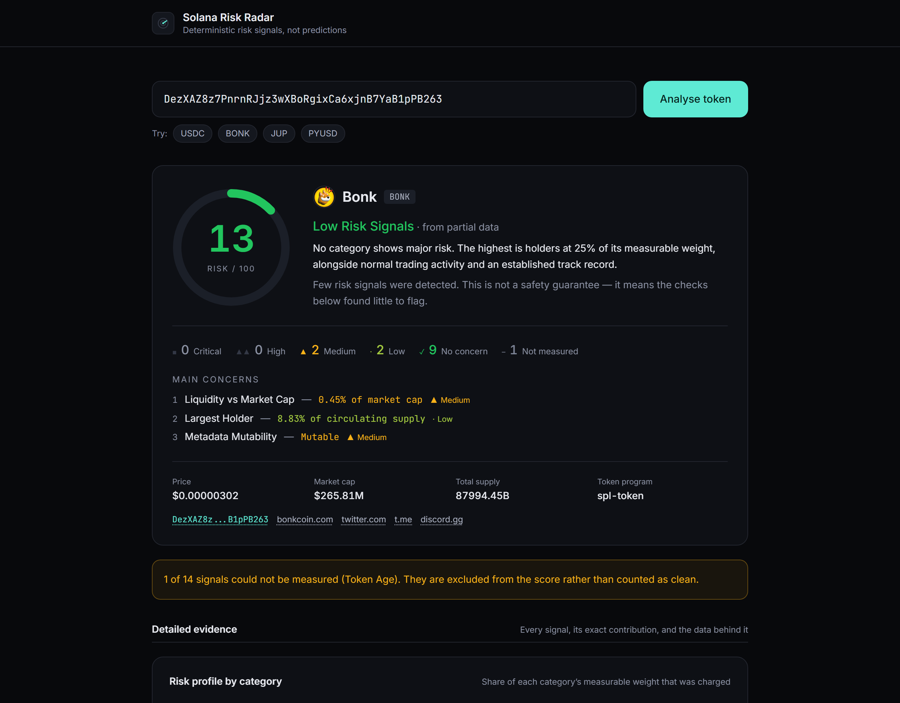

# Solana Risk Radar

**Paste any Solana token address and understand its major risk signals within seconds.**

Built for the Superteam Germany **Road to Colosseum Hackathon**.

Risk Radar reads real on-chain and market data for any SPL token mint, runs it
through a transparent deterministic scoring engine, and shows you exactly which
signals drove the result — mint and freeze authority, Token-2022 transfer
controls, holder concentration, liquidity depth, pool age, trading behaviour —
with the raw evidence behind every one.

No LLM decides whether a token is a scam. Every number comes from a published
rule with a published threshold, and identical inputs always produce an
identical score.

> **Not financial advice.** This tool reports verifiable risk factors. It never
> claims a token is "safe" or a "scam".



---

## Quick start

Requires Node.js 20+.

```bash
npm install
npm run dev
```

Open <http://localhost:3000>, paste a mint address (or click an example chip).

**No API keys. No accounts. No database.** The app works out of the box against
public Solana RPC endpoints and DexScreener's free public API.

### Optional: your own RPC endpoint

Everything works without configuration. If you have a free-tier endpoint from
[Helius](https://helius.dev), [QuickNode](https://quicknode.com) or
[Alchemy](https://alchemy.com), setting it makes holder scans faster and
removes rate-limit contention:

```bash
cp .env.example .env.local
# then set SOLANA_RPC_URL in .env.local
```

See [`.env.example`](.env.example) for the details — including one endpoint you
should *not* use.

---

## Scripts

| Command | What it does |
|---|---|
| `npm run dev` | Development server |
| `npm run build` | Production build |
| `npm run start` | Serve the production build |
| `npm test` | Unit tests for the risk engine (no network) |
| `npm run typecheck` | TypeScript, no emit |
| `npm run lint` | ESLint |
| `npm run verify` | typecheck → lint → test → build |
| `npm run probe` | Integration probe against real mainnet tokens |
| `npm run ui-check` | Headless browser check, desktop + mobile |

`probe` and `ui-check` need a running server; pass a URL to target another one
(`npm run probe -- http://localhost:3100`).

---

## How it works

1. You paste a mint address. It is validated in the browser and again on the
   server, using the same pure function.
2. The server reads the mint account, then fetches four things concurrently:
   - **on-chain metadata** — Metaplex PDA, or the Token-2022 metadata extension
   - **holder distribution** — the largest token accounts, each resolved to its
     owning wallet and classified
   - **mint history** — earliest transaction, for token age
   - **market data** — liquidity, volume, pool age and trade counts
3. Fourteen deterministic rules score the result. Each returns a metric, an
   observed value, a severity, a point contribution, a plain-English
   explanation and inspectable evidence.
4. The report is presented in two layers. **Quick assessment** answers the
   question on its own — score, band, a one-sentence reason it landed there,
   how many findings at each severity, and the three that contributed most.
   **Detailed evidence** holds everything behind that answer: the category
   breakdown, every signal with its raw evidence, the classified holder table
   and the data provenance. Nothing is summarised away.

Full detail: [`ARCHITECTURE.md`](ARCHITECTURE.md) ·
[`METHODOLOGY.md`](METHODOLOGY.md) · [`DEMO.md`](DEMO.md)

---

## What it checks

| Category | Signals |
|---|---|
| **Authorities** | Mint authority, freeze authority, Token-2022 transfer controls, metadata mutability |
| **Holders** | Largest holder, holder spread (2nd–10th) |
| **Liquidity** | Total depth, depth vs market cap, pool diversity |
| **Market activity** | Volume vs liquidity, buy/sell balance, 24h price movement |
| **Maturity** | Pool age, token age |

**All five categories carry equal weight**, and they are combined
non-compensatorily — clean dimensions cannot cancel out severe ones. Exact
thresholds and the full derivation are in [`METHODOLOGY.md`](METHODOLOGY.md).

### Three things it does that most token checkers don't

**Holders are classified, not just counted.** `getTokenLargestAccounts` returns
token *accounts*, not people. A pool vault holding 40% of supply is liquidity,
and a burn address holding 40% is supply that no longer exists — neither is a
whale who can dump on you. Risk Radar resolves each account to its owning
wallet, then classifies that wallet by the program that owns it, so
concentration is measured over genuinely sellable supply. The breakdown is
shown in full so you can check the call yourself.

**Token-2022 extensions are read.** A permanent delegate can move tokens out of
your wallet at any time, and a transfer hook can block a sale outright. These
are invisible to checkers that only look at mint and freeze authority.

**Correlated signals are not double-counted.** "Largest holder" and "top 10
holders" correlate at r = 0.92 on real tokens, because the top 10 *contains*
the largest — scoring both charges one wallet twice. Risk Radar scores the
marginal share instead (holders 2–10, r = 0.07 against the largest), so the two
signals answer genuinely different questions: *can one actor crash this?* and
*is there a bloc behind them?* The familiar top-10 figure is still shown.

---

## Honesty about limits

Risk Radar is built to be trustworthy about what it does *not* know:

- **Missing data is excluded, never guessed.** A signal that cannot be measured
  scores zero points *and* drops out of the denominator, so a token is never
  made to look safe by data that failed to load. Coverage is shown on every
  report, and below 40% the score is withheld entirely as "Insufficient Data".
- **A single severe finding does not max the score.** One fully compromised
  category scores 45 of 100 — deliberately. Two reach "High". The specific
  danger is surfaced in "Main concerns" rather than inflated into the headline
  number, because the score summarises a profile and the concerns list names
  the finding.
- **Token age is often unknowable.** It is derived from signature history; a
  heavily traded token has more history than can be scanned, so its age is
  reported as unmeasured rather than guessed. A *new* token resolves exactly —
  which is the case that matters.
- **Pool and burn shares cover the largest accounts only**, not the whole
  supply. The UI says so where it matters.
- **Market data reflects what DexScreener has indexed.** A token with no
  indexed pool shows "no pools found", which is a real signal, not a bug.
- **A clean report is not a guarantee.** Off-chain promises, team intent, and
  logic in other programs are not visible here at all.

---

## Testing

Rule logic is pure — each rule is a function from a typed `AnalysisInput` to a
`RiskSignal`, with no clock, randomness or I/O — so it is tested directly
against synthetic inputs with no network:

```bash
npm test        # 79 unit tests
```

These cover every threshold boundary, both directions of each two-sided rule,
the missing-data paths, and the aggregation invariants (no signal can charge
more than its weight; an unavailable signal charges nothing; identical inputs
give identical scores).

Three groups are worth calling out:

- **Calibration** — pins the aggregation itself: that clean dimensions cannot
  cancel severe ones, that the score rises monotonically with risk, that one
  compromised category can never alone produce a "High" verdict, and that
  realistic token archetypes land in their intended bands.
- **Correlation** — proves the two holder signals stay independent: two tokens
  with near-identical top-10 totals but opposite shapes produce opposite
  findings.
- **Evidence** — audits the trust feature: every measured signal carries
  well-formed evidence, links are absolute https, evidence matches the exact
  claim its signal makes, and an unmeasured signal never implies a measurement
  happened.

Beyond unit tests, the app was driven end to end against real mainnet tokens:

| Token | What it exercises |
|---|---|
| USDC | Mainstream asset with live mint *and* freeze authority by design |
| Wrapped SOL | Reports `supply: 0` on chain — the division-by-zero trap |
| BONK | Renounced authorities, deep liquidity, healthy trading |
| JUP, PENGU, JitoSOL | Varied concentration and liquidity profiles |
| PYUSD | Token-2022 path: permanent delegate, transfer hook, transfer fee |
| TRUMP | Genuinely extreme holder concentration |
| invalid / non-mint / token-account / nonexistent addresses | Error handling |

`npm run probe` re-runs that sweep and asserts the report invariants, including
that every listed concern traces back to a measured signal and that the
severity counts total the signal count. `npm run ui-check` drives the real UI in
Chromium at desktop and mobile widths, clicking **every** evidence action on the
page and failing on any console error, page error or horizontal overflow.

---

## Deployment

A standard Next.js app — it runs anywhere Next.js runs. The fastest path:

```bash
npx vercel
```

No environment variables are required. If you want to use a private RPC
endpoint, set `SOLANA_RPC_URL` in your host's dashboard; it is read server-side
only and never reaches the browser.

The only long-lived state is a 60-second in-process cache of completed reports,
which is purely an optimisation — nothing breaks when it is cold, which is why
no database is needed.

---

## Project description (hackathon submission)

**Solana Risk Radar** turns a token address into an explainable risk report in
seconds. Paste a mint, and it reads real on-chain data (mint and freeze
authority, Token-2022 transfer controls, metadata mutability, classified holder
distribution) and real market data (liquidity depth, pool diversity, pool age,
trading behaviour), then scores it with fourteen deterministic rules whose
thresholds are published in full.

The point is not the number — it is that the number is *auditable*. Every signal
shows what was measured, what was found, how many points it contributed and
why, and opens onto the raw evidence with links to the chain. Where data is
missing it is excluded from the score rather than guessed at, and the tool never
claims a token is safe or a scam. Built with Next.js and TypeScript, with no
API keys, no accounts and no database.

---

## Licence

MIT
